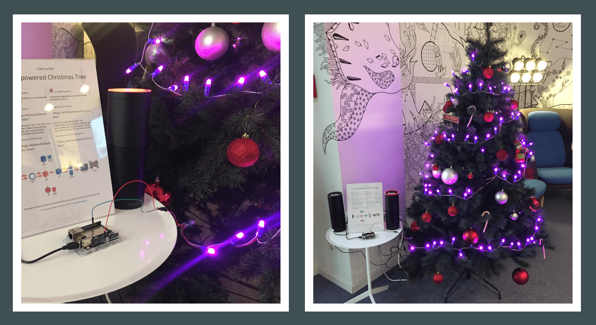
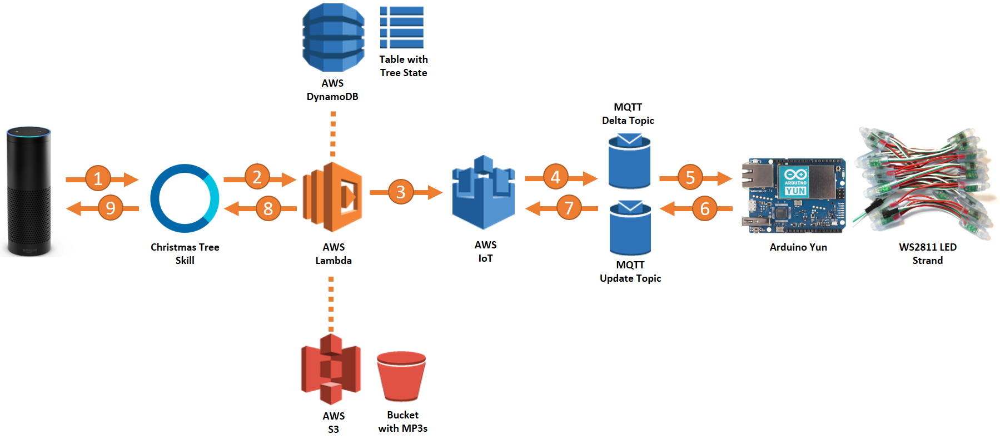

## An Alexa-controlled Christmas Tree

See it live in action: [Demo video](https://www.youtube.com/watch?v=acqHYu_rtrA)


Here you can find the sources of a custom Alexa skill that controls an LED strand on a Christmas
tree. This repo contains:
* Java code for an AWS Lambda function which is the endpoint for the Alexa skill
* An Arduino sketch which sits between AWS IoT and a WS2811 LED strand. The sketch is optimized for running on an Arduino Yun.

####The Hardware setup
If you want to build your own Alexa-controlled christmas tree with help of these sources you need specific hardware. This project used the
following components:
* 1 x [Arduino Yun with Linino OS](https://www.arduino.cc/en/Main/ArduinoBoardYun)
* 2 x [WS2811 LED Strand with 50 LEDs each](https://www.amazon.com/dp/B013FU2PZ4)
* 3 x [Jumper wires](https://www.amazon.com/dp/B01EV70C78)
* 1 x [Power Supply Adapter and 2.1mm x 5.5mm DC Connector](https://www.amazon.com/dp/B00ZU9MZ1S)
* 1 x [Micro-USB to USB Cable](https://www.amazon.com/dp/B00NH13O7K)
* 1 x [Amazon Echo](https://www.amazon.com/dp/B00X4WHP5E) or [Amazon Dot](https://www.amazon.com/dp/B015TJD0Y4) or [Amazon Tap](https://www.amazon.com/dp/B01BH83OOM)

####The Software solution
The following image illustrates a typical roundtrip to handle a voice user request.



The solution leverages a bunch of AWS cloud services to communicate with the hardware backend - the
christmas tree. The only things you really need to set up is the Lambda function, an S3 bucket containing
the MP3 files and an IAM role with AWS IoT and Dynamo permissions. The table in Dynamo as well as
the thing shadow in AWS IoT will be created on the first skill invocation on the fly.

Understand what happens on a voice user request given to an Alexa device:

1. User speaks to Alexa to _"open the christmas tree"_. ASR and NLU magic happens in the Alexa cloud service.

2. An intent is given to the skill code hosted in AWS Lambda. You can find the code in this repo.

3. If the user just desires an action like _"turn on the tree"_ or _"start the show"_ without giving
this skill a color for the tree it looks up the last set color in Dynamo DB. If there's a color
given the skill will persist the information in the same table. This is how Alexa keeps in mind the last set color
of the tree. Secondly, the action and the color command is written to a thing shadow in AWS IoT.

4. If the shadow is updated an MQTT message is exposed to the delta topic of the corresponding thing. The Arduino Yun
is subscribed to that topic. Side note: The name of the thing being created by the skill code is equal
to the skill-id coming in (all dots replaced with a dash). This might help you if you want to rebuild the project.

5. The Arduino is polling on the Delta topic so it receives the commands as an MQTT message in JSON format.
The information is extracted and the Arduino sketch performs an action with the LED strand according to what is given in the message (new color, christmas show, on, off).

6. Finally, the Arduino sends an MQTT message to the Update topic of the AWS IoT thing in order to let the world know
that the action was performed.

7. The message is consumed by the AWS IoT service and the contained state information
is written back to the thing shadow as a _reported_ state. It would be possible to also have the skill read the last tree state from the thing shadow
instead of looking it up in Dynamo DB. The reason for this fallback approach is MQTT is asynchronous and we cannot rely on
the Arduino to give an immediate response.

8. Actually this step happens right after step 3) as the skill is decoupled from the hardware backend on purpose.
So right after updating the thing shadow in AWS IoT the skill code returns output speech text and optionally an
_SSML_ tag with audio contents. The MP3s which are part of Alexa's playback (christmas sounds) are stored in an AWS S3 bucket.

9. Alexa reads out the text returned by the skill and plays back the audio in the response.

####Status indication
While Arduino does its work it lets you know of its current state over the first LED in the strand.
* a one time red blinking light indicates a AWS IoT connection setup failure
* a two times red blinking light indicates a failed AWS IoT connection attempt
* a three times red blinking light indicates a failed AWS IoT connection configuration
* a green flashlight indicates a successful connection to AWS IoT
* a blue flashlight indicates constant polling to the AWS IoT topic
* a yellow flashlight indicates an error while polling the AWS IoT topic

On startup you might see red flashlights for the period of time it takes for the Arduino to connect to
the Wifi. If Wifi is connected there's the green flashlight followed by a constantly blinking blue light to
indicate the tree is ready for commands.

If yellow is blinking the AWS IoT topic could not be reached. If that happens (e.g. Arduino lost Wifi connection)
it keeps trying for nine more times until it automatically tries to reconnect. That said, after ten times yellow flashlight
there should be red / green flashlight for reconnection progress. Once the Arduino reconnects to the Wifi and AWS IoT
is reached again, the blue flashlights come up.

###How to rebuild
If you have any question reach out to the author via

[](https://gitter.im/alexa-xmas-tree/Lobby?utm_source=badge&utm_medium=badge&utm_campaign=pr-badge&utm_content=badge)

These are the requirements in order to be able to rebuild the solution
* All the hardware listed in above section
* An [AWS account](https://aws.amazon.com) for the backend resources
* An [Amazon developer account](https://developer.amazon.com)

1. Check out this repository using git

2. In [Amazon developer account](https://developer.amazon.com) after you logged in go to Alexa > Alexa Skills Kit > Add a new skill

3. Set up the _Skill information_ with
    * __Skill type__: Custom interaction model
    * __Language__: Of your choice (you could add more later on)
    * __Name__: Christmas Tree (but feel free to choose another name)
    * __Invocation Name__: christmas tree (for English) or weihnachtsbaum (for German)

4. Click _Next_ and go back to _Skill information_ to copy the _ApplicationId_. You will need it in the next steps

5. In your [AWS account](https://aws.amazon.com) go to S3 and create a new bucket and name it as you like

6. Upload all the MP3 files you can find in the _audio_ folder to the newly created bucket. Secondly, select the freshly uploaded files in the S3 web interface, go to _Actions_ and _Make Public_. Finally,
in _Properties_ of your bucket go to _Permissions_ and _Add CORS configuration_ where you would paste and save this xml portion:

    ```xml
    <CORSConfiguration xmlns="http://s3.amazonaws.com/doc/2006-03-01/">
        <CORSRule>
            <AllowedOrigin>http://ask-ifr-download.s3.amazonaws.com</AllowedOrigin>
            <AllowedMethod>GET</AllowedMethod>
        </CORSRule>
    </CORSConfiguration>
    ```

7. Next, in AWS go to IAM and create a new role called something like _"Xmas-Lambda-Execution"_. To keep things simple just add these three managed policies to it (later you would
go for the least privileges approach and adjust permission as needed)
    * AmazonS3FullAccess
    * AmazonDynamoDBFullAccess
    * AWSIoTFullAccess

8. Create a group in IAM with name _"Xmas-Arduino-Access"_ and add AWSIoTFullAccess as the managed policy.

9. Create a user in IAM for programmatic access and add it to the _"Xmas-Arduino-Access"_ group. Save the credentials (AccessId and AccessSecret) provided at the end of the creation process.

10. Now edit the first two configuration items in the [app.properties](/src/main/resources/app.properties) file in your local repo.
    * __AlexaAppId__ should be the the applicationId you got in step 4.
    * __S3BucketUrl__ should be the url to the bucket you created in step 5.

11. Now _mvn package_ the project and you should get a JAR file.

12. In AWS create a new Lambda function for Java8 and choose the existing execution role you created in step 7. Upload the JAR file to this function. The Lambda event trigger must be set to _Alexa skills Kit_. If you don't see it in the list you are in the wrong AWS region. Make sure to create the Lambda function in either Ireland or N. Virginia. If you're using my code the  handler must be set to _io.klerch.alexa.xmastree.skill.XmasSpeechletHandler_.

13. Go back to your skill in the [Amazon developer console](https://developer.amazon.com) and proceed with the skill configuration.
    * The _Interaction model_ section you set up just be copy and paste what you can find in the [resources/in](/src/main/java/resources/in)-folder in this repo. Don't forget to create a custom slot with name _TreeColors_ and add values of one of the customSlot-TreeColors.txt files.
    * In the _Configuration_ section you point to your Lambda function you created in step 12. The ARN can be obtained in the top right corner in AWS Lambda details page.
    * In _Test_ section just make sure test is _enabled_
    * Execute a test in the _Service simulator_ in the _Test_ section. Enter the utterance _Start christmas tree_ (_Starte Weihnachtsbaum_ for German). The first invocation takes
     its time because what happenes in the background is an AWS Dynamo-table is built and an AWS IoT thing is created as well. This initial test
     is mandatory for the last step because the Arduino needs to have a connection to an MQTT topic which is created with the IoT thing.

14. Next, set up your Arduino Yun and connect it to a Wifi (Howto: https://www.arduino.cc/en/Guide/ArduinoYun)

15. Connect your WS2811 LED strand to the Arduino. Make sure you use the data-pin 6. If you have any question on this please contact me.

16. Follow the installation instructions at https://github.com/aws/aws-iot-device-sdk-arduino-yun. This project uses
 MQTT over WebSockets. Keep that in mind when you are reading and doing the instructions. The Access key and secret they are
 talking about are the ones you got in step 9.

17. Edit the [aws_iot_config.h](/arduino/xmastree/aws_iot_config.h) in your local repo and adjust values for:
    * __AWS_IOT_MQTT_HOST__ is specific to your account. The easiest way to obtain your endpoint is to use the following command in [AWS CLI](https://aws.amazon.com/cli/):
    ```bash
    $ aws iot describe-endpoint
    ```
    * __AWS_IOT_MY_THING_NAME__ needs to be the applicationId you got in step 4. Make sure you replace all dots in that id with dashes.
    * __AWS_IOT_ROOT_CA_FILENAME__ name of the root certificate you uploaded to the Arduino as instructed in step 14.

18. With Arduino IDE upload the sketch you can find in the [arduino](/arduino)-folder in this repo.
    * You should see progress and status looking at the first LED on the strand. If your Arduino is still connected
    to your computer you could also use the _Service Monitor_ tool to get detailed information and serial output.
